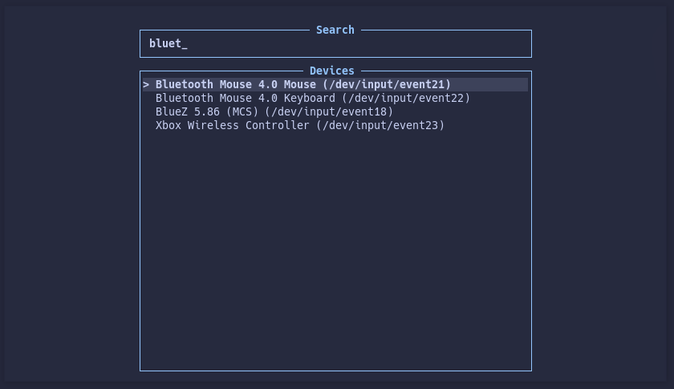
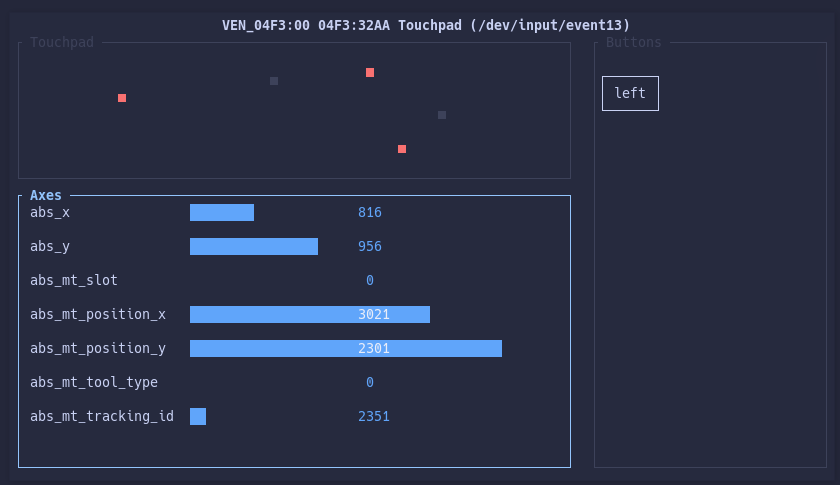
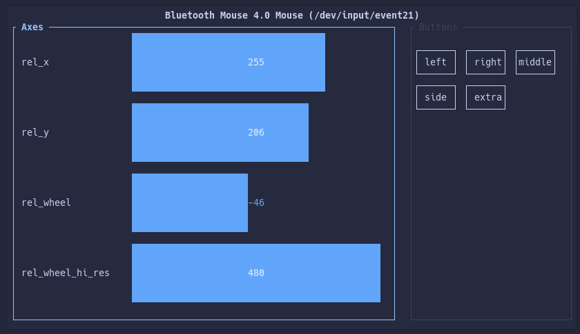

# evtr

`evtr` is a terminal UI for inspecting Linux evdev input devices. Select a
device from `/dev/input/event*`, then watch axes, relative motion, buttons,
hats, joysticks, and touch state update live.

## Screenshots

### Selector



### Gamepad


### Touchpad



### Mouse



## Requirements

- Linux with evdev support
- Rust 1.85 or newer to build from source
- A terminal supported by `crossterm`
- Permission to read the selected `/dev/input/event*` node

If you see permission errors, grant your user read access to the relevant input devices.
The exact group or udev rule is distro-specific.

## Install And Run

Build the release binary from a checkout:

```sh
cargo build --release
./target/release/evtr
```

Install it into your Cargo bin directory from the local checkout:

```sh
cargo install --path .
evtr
```

Or run it directly without installing:

```sh
cargo run --release
```

## Config

`evtr` reads config from:

- `--config <path>` when provided
- `$XDG_CONFIG_HOME/evtr/config.toml` when that file exists
- `~/.config/evtr/config.toml` when the XDG file does not exist and the fallback file does

When `XDG_CONFIG_HOME` is set to an absolute path, `--generate-config` and
`--print-config-path` use `$XDG_CONFIG_HOME/evtr/config.toml` even if the
directory does not exist yet.

To generate a starter config file:

```sh
cargo run --release -- --generate-config
```

To write the starter config to a specific path:

```sh
cargo run --release -- --config /path/to/evtr.toml --generate-config
```

Other config-related flags:

- `--print-config-path`: print the path used for config generation
- `--print-default-config`: print the full default TOML template

Config is strict: unknown fields, invalid values, and duplicate/conflicting key bindings fail fast.

### Config Reference

`--print-default-config` prints the complete supported config surface. The
high-level sections are:

- `selector`: device sort order and selector page size
- `monitor`: page scroll size, startup focus, joystick inversion, and relative axis range
- `theme.palette`: five hex colors used by the TUI
- `layout.selector` and `layout.monitor`: panel sizing knobs
- `keys.selector` and `keys.monitor`: explicit key binding lists

## Controls
- `?` to open help

## Failure Modes

`evtr` will report actionable errors when:

- `/dev/input` cannot be read
- Event nodes exist but cannot be opened
- The selected device stream ends or returns an I/O error
- Terminal initialization or redraw fails
